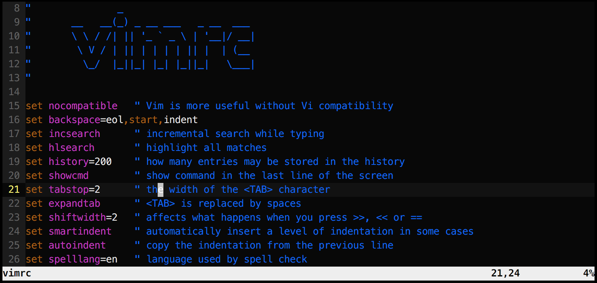
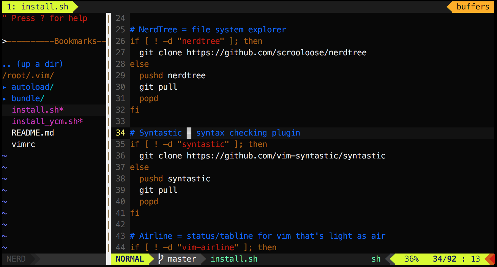

# .vim
This is the basic setup of my vim text editor. Rather than having millions
of custom commands and thousands of plugins, I try to keep it simple and
include only extensions which I am actually using. Therefore, it should be
easy to switch to this configuration from any other vim setup and eventually
to switch back to anything else.

## Installation

### No plugins

The simplest way you can use my vim configuration is to copy
[vimrc](./vimrc) file
(or its parts) to your `~/.vimrc`. This way you don't need to install
any plugins and you'll get the basic highlighting, indentation and
shortcuts which I'm using every day. This should work with pretty much
every Vim version on every Unix-based system.



### Basic plugins

> Vim is awesome, and it is even more awesome with a bunch of extensions.

On my machines, I like to **clone this repository as `~/.vim/`** and then use

```
./install.sh
```

to pull (or update) all the plugins.
You can also download plugins manually, but having a small script
to maintain them proved to be useful to me.

All of the extensions installed by the script should work with most of
the major vim versions and don't need any special setup. The only exception
is Airline, which is using **Powerline fonts** for fancy ASCII-art GUI (as you can see bellow).
After installation is done you need to **change your terminal font** to any
font supported by Powerline. I personally like using
`12pt Meslo LG M Regular for Powerline`. Alternatively, you can disable
fancy Powerline fonts by changing `let g:airline_powerline_fonts=0`
in `vimrc`.



### Full swing (YouCompleteMe)

One more plugin I really like to use is called
[YouCompleteMe](https://valloric.github.io/YouCompleteMe/),
it's very easy-to-use and powerful code completion engine.

The only reason why it is not included in the previous section is, that it
is a bit more difficult to get working.

First of all, you need to have at least Vim 7.4.1578
with Python 2 or Python 3 support (check your `vim --version`).

Install necessary development tools:

```
apt-get install build-essential cmake
apt-get install python-dev python3-dev
```

Then, you should be able to build the extension itself:

```
./install_ycm.sh
```


